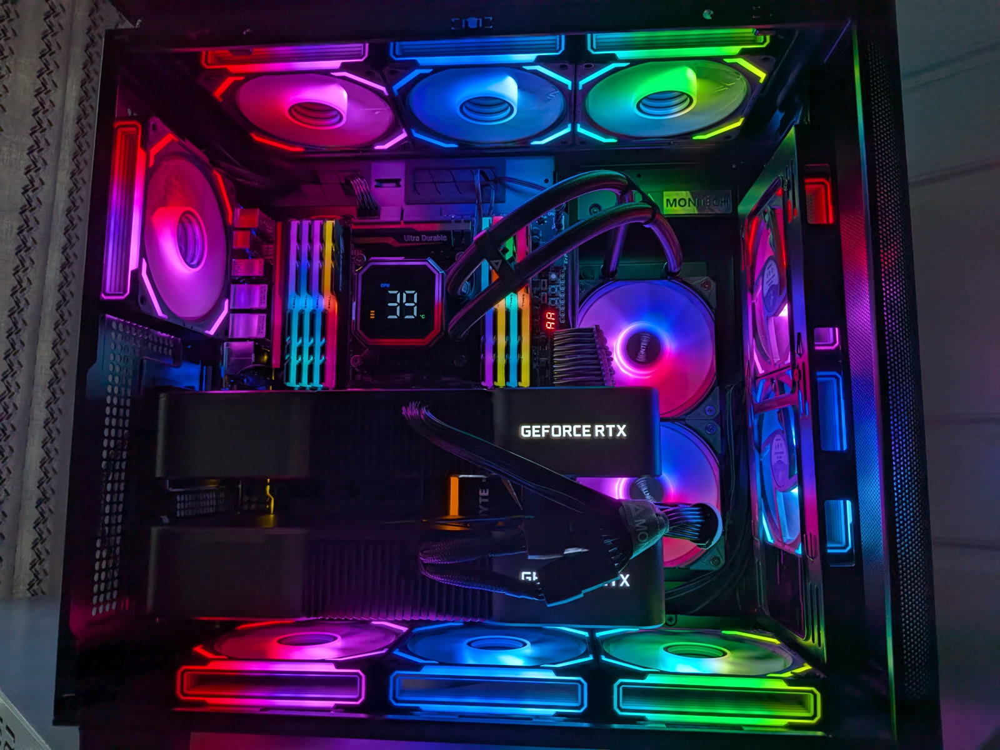
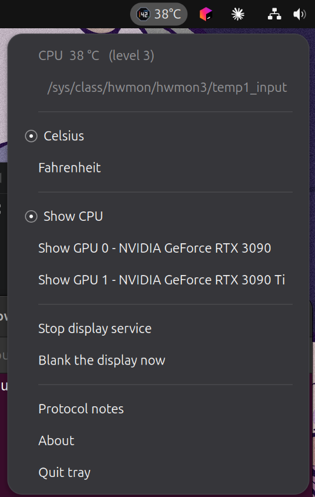

<div align="center">

# montech-hyperflow-linux

**A Linux driver for the temperature display on the Montech HyperFlow
_Digital_ AIO cooler.**

The **Digital** models have a small screen on the pump head, and Montech only
ships a Windows app to drive it. I reverse-engineered the protocol so it works
on Linux: a background service, a panel indicator, and no dependencies beyond
Python itself.

<sub>The plain <b>HyperFlow</b> — without “Digital” in the name — has no
screen, so there is nothing here for it.</sub>

[](LICENSE)
[](docs/PROTOCOL.md)
[](#why-no-dependencies)
[](https://github.com/banguit/montech-hyperflow-linux/releases/latest)



<sub>The pump head reading live CPU temperature on Linux — digits, the
<code>CPU</code> label and the level bar all driven by this project.</sub>

</div>

---

> **This is not Montech software.** I wrote it to make my own cooler work on
> Linux and published it in case it is useful to someone else. It is
> unofficial, written from scratch, and not affiliated with or endorsed by
> Montech. See [`NOTICE.md`](NOTICE.md).

## Does this work with my cooler?

If the pump head has a digital temperature display and shows up like this,
yes:

```console
$ lsusb | grep 1a2c
Bus 003 Device 006: ID 1a2c:4e85 China Resource Semico Co., Ltd USB Gaming Keyboard
```

"USB Gaming Keyboard" is a generic string baked into the OEM controller — not
a sign you have the wrong device.

| | |
|---|---|
| **Confirmed working** | HyperFlow Digital 240 |
| **Expected to work** | HyperFlow Digital 360 — same protocol, same controller |
| **Quite likely** | Other rebrands of the OEM platform **TCOMAS DH-C100** |
| **Not applicable** | **HyperFlow** and **HyperFlow ARGB** — no display on the pump head, so nothing to drive |

The distinguishing feature is the **screen**, not the name: if your pump head
shows a number, this is for you. If it only glows, it is the non-Digital
model and this project does nothing for it.

Got a rebrand that works? [Open an issue](../../issues) and say so.

## Download

Prebuilt packages are attached to every release:

### **[→ Download the latest release](https://github.com/banguit/montech-hyperflow-linux/releases/latest)**

| Your distro | File | Install it with |
|---|---|---|
| Debian, Ubuntu, Mint, Pop!_OS | `montech-hyperflow_*_all.deb` | `sudo apt install ./montech-hyperflow_*_all.deb` |
| Fedora, RHEL, openSUSE | `montech-hyperflow-*.noarch.rpm` | `sudo dnf install ./montech-hyperflow-*.noarch.rpm` |
| Anything else | `montech-hyperflow-*.tar.gz` | unpack, then `sudo make install` |

The `-tray` RPM is the optional panel indicator; the `.deb` includes it
already. `SHA256SUMS` is attached too — verify with
`sha256sum -c SHA256SUMS`.

After installing, jump to [checking it found your cooler](#install).

> Releases marked **Pre-release** are early builds. `v1.0.0-alpha1` is the
> current one: the protocol is confirmed on real hardware, but the packaging
> for some formats has had little real-world use.

## Install

> The repository is `montech-hyperflow-linux`; everything it installs is
> plain `montech-hyperflow` — the command, the package, the systemd unit and
> the config file.

```bash
git clone https://github.com/banguit/montech-hyperflow-linux
cd montech-hyperflow-linux
make test                # no hardware needed, should be all green
sudo make install        # the driver, the service, device permissions
sudo make install-tray   # optional: the panel indicator
```

Check it found your cooler — this writes nothing to the device:

```bash
montech-hyperflow --list
```

You want to see `/dev/hidraw5` (or similar) marked **writable**:

```console
matching hidraw nodes (0xFF01 vendor collection):
  /dev/hidraw5  feature report 63 data bytes -> 64-byte frame  stable: /dev/montech-hyperflow
all 1a2c:4e85 nodes:
  /dev/hidraw4     no vendor collection - do not write to this one  0600 NOT writable by you
  /dev/hidraw5     vendor display                                   0660 writable
cpu sensor: /sys/class/hwmon/hwmon3/temp1_input
            reads 41.0 C  [Package id 0]
```

Try it in the foreground before committing to a service:

```bash
montech-hyperflow --test-value 42     # put a known number on the head
montech-hyperflow                     # live CPU temperature
```

Happy? Turn it on permanently:

```bash
sudo systemctl enable --now montech-hyperflow
```

Prefer a package? `make deb` builds one, and CI publishes `.deb`, `.rpm`,
Arch, AppImage, Flatpak and Snap — see [which one to
pick](#which-package-should-i-use).

## The panel indicator

`montech-hyperflow-tray` puts the temperature in your top bar, with the
things worth having one click away:



Each GPU is listed by name, because "Show GPU" is meaningless on a two-card
machine. Settings are written through polkit, so expect one authentication
prompt.

The tray is a **client**. It never opens the device — the service owns that,
so the display keeps working when you log out or sit at the login screen.

> **GNOME:** tray icons need the *AppIndicator and KStatusNotifierItem*
> extension. Ubuntu enables it by default; on stock GNOME install
> `gnome-shell-extension-appindicator`.

## Everyday use

```bash
montech-hyperflow --list                       # devices, permissions, sensors
montech-hyperflow --status                     # what the running service is doing
montech-hyperflow --fahrenheit                 # °F
montech-hyperflow --source gpu --gpu-index 1   # second GPU
montech-hyperflow --blank                      # clear the display
montech-hyperflow --dry-run                    # print frames, write nothing
```

Settings live in `~/.config/montech-hyperflow.conf` or
`/etc/montech-hyperflow.conf` — see
[the annotated example](packaging/montech-hyperflow.conf.example). Flags
always beat the file.

## Things that might surprise you

**The bar only fills at 90 °C.** The ten-segment bar is `°C ÷ 10`, so idling
at 35 °C lights three segments. It's a coarse thermometer, not a load meter.
That's the vendor's design, confirmed on hardware.

**In °F the bar still follows Celsius.** At 50 °C the head reads `122 °F`
with the bar at five segments, not nine. The vendor computes the bar *before*
converting, and this driver reproduces that deliberately.
[Confirmed on hardware](docs/PROTOCOL.md); please don't "fix" it.

**Above 93 °C, °F mode always reads `199`.** 93 °C is 199 °F and the vendor
clamps there.

**A dead sensor never shows `0`.** Zero is a real temperature. The driver
holds the last good reading, then blanks.

**Unplugging is fine.** The daemon rediscovers the device — even under a new
`/dev/hidrawN` — and reopens with backoff.

## Troubleshooting

<details><summary><b><code>--list</code> finds nothing</b></summary>

The pump head's internal USB header probably isn't connected to the
motherboard. Check with `lsusb | grep 1a2c`.
</details>

<details><summary><b>"permission denied on /dev/hidrawN"</b></summary>

You need to be in `plugdev`, and you need to have logged out and back in
since being added:

```bash
id -nG | grep plugdev || sudo usermod -aG plugdev "$USER"
```

If the rule itself didn't take:

```bash
sudo udevadm control --reload
sudo udevadm trigger --subsystem-match=hidraw --action=add
```
</details>

<details><summary><b>"write failed: [Errno 32] Broken pipe"</b></summary>

The firmware rejected the transfer — almost always a wrong frame length.
Check `--list` reports a **64-byte frame** and don't pass `--frame-len`.
</details>

<details><summary><b>Nothing appears in the panel</b></summary>

Check the GNOME AppIndicator extension is enabled, then run
`montech-hyperflow-tray` in a terminal and read the errors.
</details>

<details><summary><b>The service won't start</b></summary>

```bash
systemctl status montech-hyperflow
journalctl -u montech-hyperflow -n 30
```

Exit code **78** means a permanent misconfiguration — a bad config file, no
sensor, or no permission. The service deliberately won't restart-loop on it.
</details>

## Which package should I use?

This software needs a udev rule and a system service, which sandboxed formats
can't install. That constrains the choice:

| Format | Service + permissions | Tray | |
|---|:---:|:---:|---|
| **`.deb` / `.rpm` / Arch** | ✅ | ✅ | **Recommended** |
| AppImage | ⚠️ | ✅ | Run `setup` once as root for device access |
| Flatpak | ❌ | ✅ | Tray only; pair with a native daemon |
| Snap | ⚠️ | ✅ | Needs `snap connect montech-hyperflow:hidraw` |

## How it works

One 64-byte HID **feature** report per second, report ID `0x07`, on the
vendor collection of interface 01:

```
byte 0    0x07                     report ID
byte 1    hundreds digit  ┐
byte 2    tens digit      ├─ the number on the display
byte 3    ones digit      ┘
byte 4    (level << 4) | unit      level = °C ÷ 10, capped at 9  → the bar
                                   unit: 0 = °C, 1 = °F          → the mark
byte 5    0 = CPU, 1 = GPU                                       → the label
6..63     0x00
```

Write-only. No handshake, no checksum, nothing to read back.

The protocol was recovered from the vendor's Windows app, corrected against
the device's own HID report descriptor, and then **verified byte by byte
against the physical display**. [`docs/PROTOCOL.md`](docs/PROTOCOL.md) records
the confidence level of every claim and the `DeviceDriver.exe` address behind
it; [`docs/EXPERIMENTS.md`](docs/EXPERIMENTS.md) is the experiment log.

### Why no dependencies

The daemon is pure Python standard library — no hidapi, no libusb, no pyudev,
no D-Bus binding. It writes to `/dev/hidrawN` with one `ioctl`. GTK lives only
in the tray package, so a headless machine never pulls it in.

The tray reads a small JSON status file the daemon writes to `/run`, and
drives the service through `systemctl`. No IPC protocol to go wrong, and you
can `cat` the status yourself.

## Contributing

The most valuable contribution is **running an experiment and reporting what
the pump head did** — including negative results. "Sweeping `level` changed
nothing on my 360" is real data. See
[`CONTRIBUTING.md`](CONTRIBUTING.md).

Please don't send vendor binaries or vendor code.

```bash
make test     # 87 hardware-free tests
make lint     # syntax, udev rule, desktop file, polkit XML, icons
```

## Support the project

This is a spare-time project and it will always be free. If it saved you an
afternoon and you would like to say thanks:

- **[PayPal](https://www.paypal.com/donate/?business=SD7SXSNVLLU2W&no_recurring=0&currency_code=USD)**
- **[Buy Me a Coffee](https://buymeacoffee.com/dmytroantonenko)**

Reporting that it works on a cooler I do not own is worth more than money —
see [Contributing](#contributing).

## License

[GPL-3.0-or-later](LICENSE). See also [`NOTICE.md`](NOTICE.md) on naming,
trademarks and reverse engineering.
